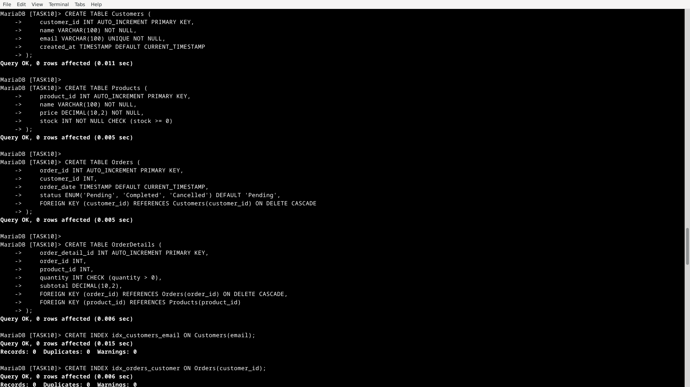
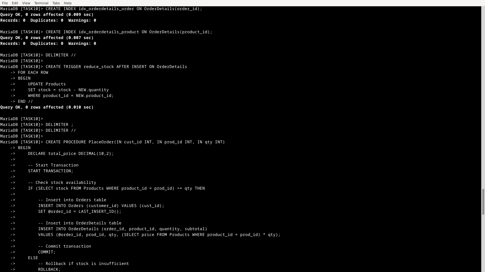
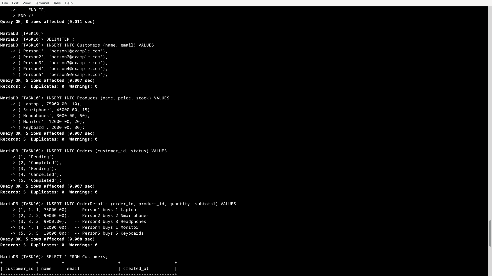
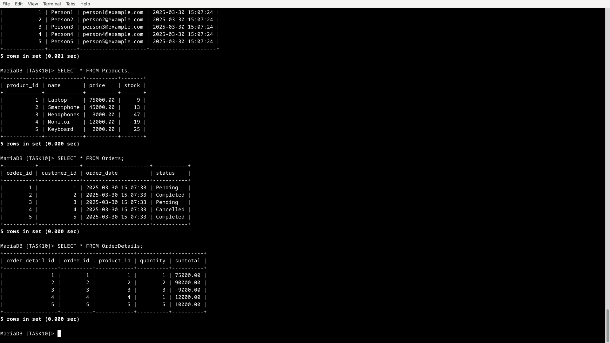

# Keywords Used in Database Design, Optimization, and Advanced Features

| Feature            | Purpose                                              |
|--------------------|------------------------------------------------------|
| CREATE TABLE      | Defines tables with primary and foreign keys         |
| AUTO_INCREMENT    | Automatically increments primary keys                |
| CHECK            | Ensures data validation (e.g., stock ≥ 0)            |
| FOREIGN KEY      | Establishes relationships between tables             |
| ON DELETE CASCADE | Automatically deletes related data                   |
| CREATE INDEX     | Improves query performance                            |
| CREATE TRIGGER   | Enforces automatic updates (e.g., reducing stock)    |
| START TRANSACTION | Begins a transaction                                 |
| COMMIT          | Confirms transaction changes                          |
| ROLLBACK        | Reverts transaction changes if an error occurs        |

