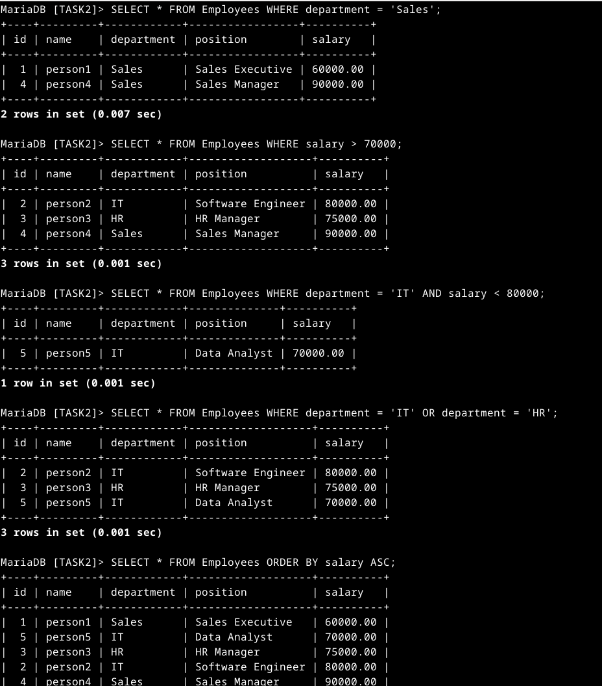

# SQL Keywords Used in Basic Filtering and Sorting

| Keyword       | Function |
|--------------|-----------------------------------------------------------|
| `CREATE TABLE` | Defines a new table with specified columns and data types. |
| `PRIMARY KEY`  | Ensures each record in a table has a unique identifier. |
| `AUTO_INCREMENT` | Automatically generates a unique value for a column. |
| `VARCHAR(n)`   | Defines a column to store variable-length text (string). |
| `DECIMAL(m,d)` | Stores decimal values with precision (e.g., salary). |
| `NOT NULL`     | Ensures a column cannot have NULL (empty) values. |
| `INSERT INTO`  | Adds new rows of data into a table. |
| `VALUES`       | Specifies the values to be inserted into a table. |
| `SELECT`       | Retrieves data from a table. |
| `FROM`         | Specifies the table from which to retrieve data. |
| `WHERE`        | Filters records based on conditions. |
| `AND`          | Combines multiple conditions that must all be met. |
| `OR`           | Combines multiple conditions where at least one must be met. |
| `ORDER BY`     | Sorts query results in ascending (`ASC`) or descending (`DESC`) order. |
| `*` (Wildcard) | Selects all columns from a table. |
