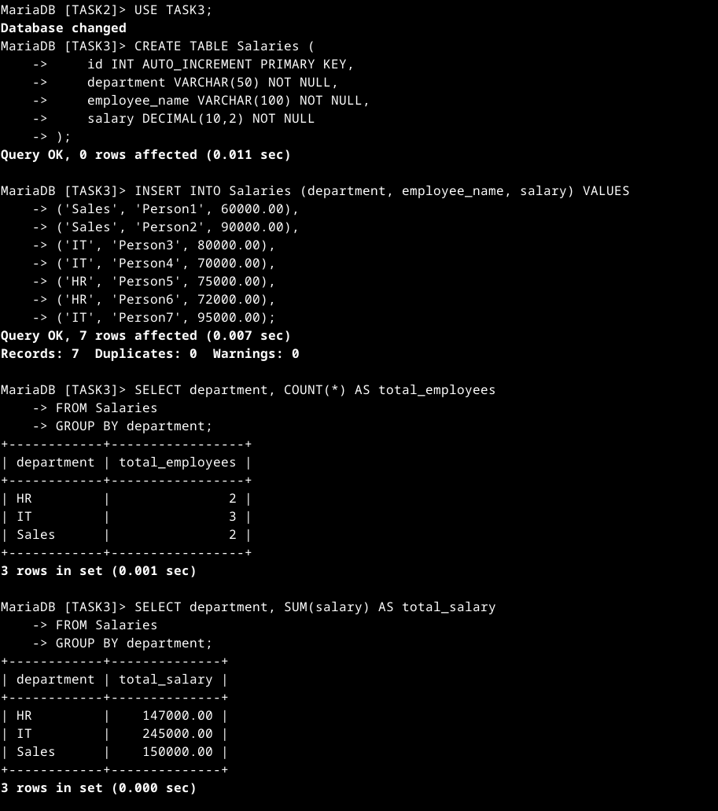

# SQL Keywords Used in Simple Aggregation and Grouping

| Keyword       | Function |
|--------------|-----------------------------------------------------------|
| `CREATE TABLE` | Defines a new table with specified columns and data types. |
| `PRIMARY KEY`  | Ensures each record in a table has a unique identifier. |
| `AUTO_INCREMENT` | Automatically generates a unique value for a column. |
| `VARCHAR(n)`   | Defines a column to store variable-length text (string). |
| `DECIMAL(m,d)` | Stores decimal values with precision (e.g., salary). |
| `NOT NULL`     | Ensures a column cannot have NULL (empty) values. |
| `INSERT INTO`  | Adds new rows of data into a table. |
| `VALUES`       | Specifies the values to be inserted into a table. |
| `SELECT`       | Retrieves data from a table. |
| `FROM`         | Specifies the table from which to retrieve data. |
| `GROUP BY`     | Groups records that have the same values in specified columns. |
| `COUNT()`      | Counts the number of rows that match a condition. |
| `SUM()`        | Calculates the total sum of a numeric column. |
| `AVG()`        | Computes the average value of a numeric column. |
| `HAVING`       | Filters grouped data based on an aggregate condition. |

