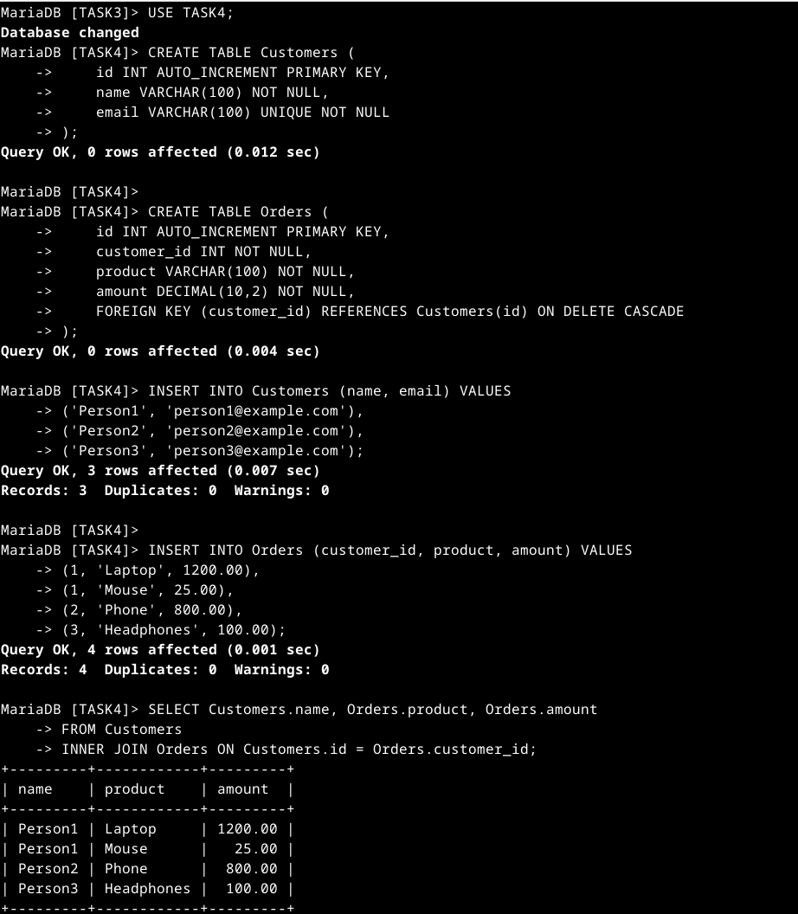
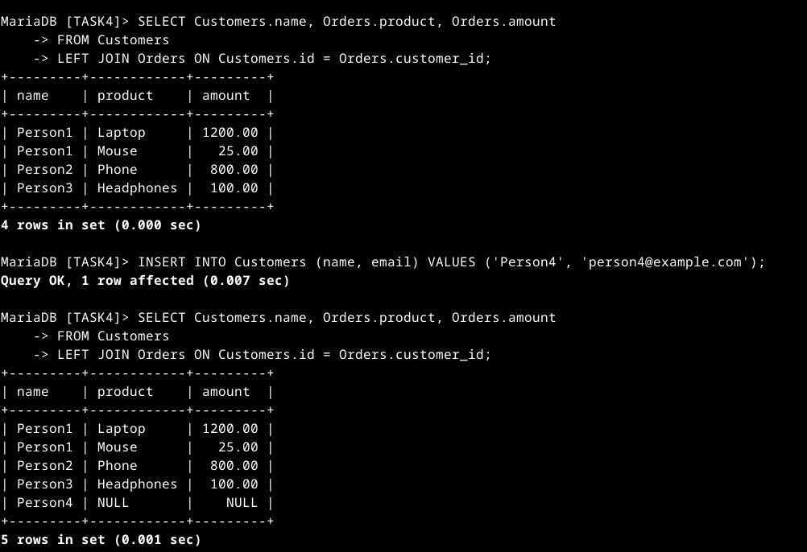

# SQL Keywords Used in Multi-Table JOINs

| Keyword       | Function |
|--------------|-----------------------------------------------------------|
| `CREATE TABLE` | Defines a new table with specified columns and data types. |
| `PRIMARY KEY`  | Ensures each record in a table has a unique identifier. |
| `AUTO_INCREMENT` | Automatically generates a unique value for a column. |
| `FOREIGN KEY`  | Establishes a relationship between two tables. |
| `ON DELETE CASCADE` | Automatically removes related records when the referenced record is deleted. |
| `INSERT INTO`  | Adds new records into a table. |
| `VALUES`       | Specifies values to be inserted into a table. |
| `SELECT`       | Retrieves data from a table. |
| `FROM`         | Specifies the table from which to retrieve data. |
| `INNER JOIN`   | Returns only matching records from both tables. |
| `LEFT JOIN`    | Returns all records from the left table and matching records from the right table, filling `NULL` if no match is found. |
| `ON`           | Specifies the condition for joining tables. |

