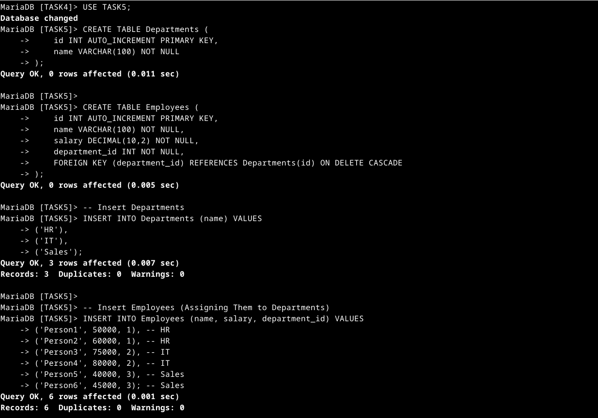
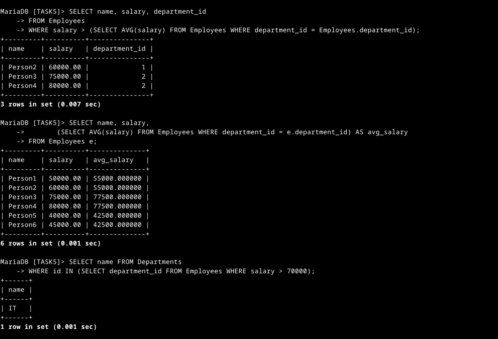

# SQL Keywords Used in Subqueries and Nested Queries

| Keyword       | Function |
|--------------|-----------------------------------------------------------|
| `CREATE TABLE` | Defines a new table with specified columns and data types. |
| `PRIMARY KEY`  | Ensures each record in a table has a unique identifier. |
| `AUTO_INCREMENT` | Automatically generates a unique value for a column. |
| `FOREIGN KEY`  | Establishes a relationship between two tables. |
| `ON DELETE CASCADE` | Deletes related records when the parent record is deleted. |
| `INSERT INTO`  | Adds new records into a table. |
| `VALUES`       | Specifies values to be inserted into a table. |
| `SELECT`       | Retrieves data from a table. |
| `FROM`         | Specifies the table from which to retrieve data. |
| `WHERE`        | Filters records based on a condition. |
| `AVG()`        | Calculates the average value of a column. |
| `IN`           | Checks if a value exists within a set of values returned by a subquery. |
| `>`            | Compares values to filter results. |
| `AS`           | Assigns an alias to a column or table. |

