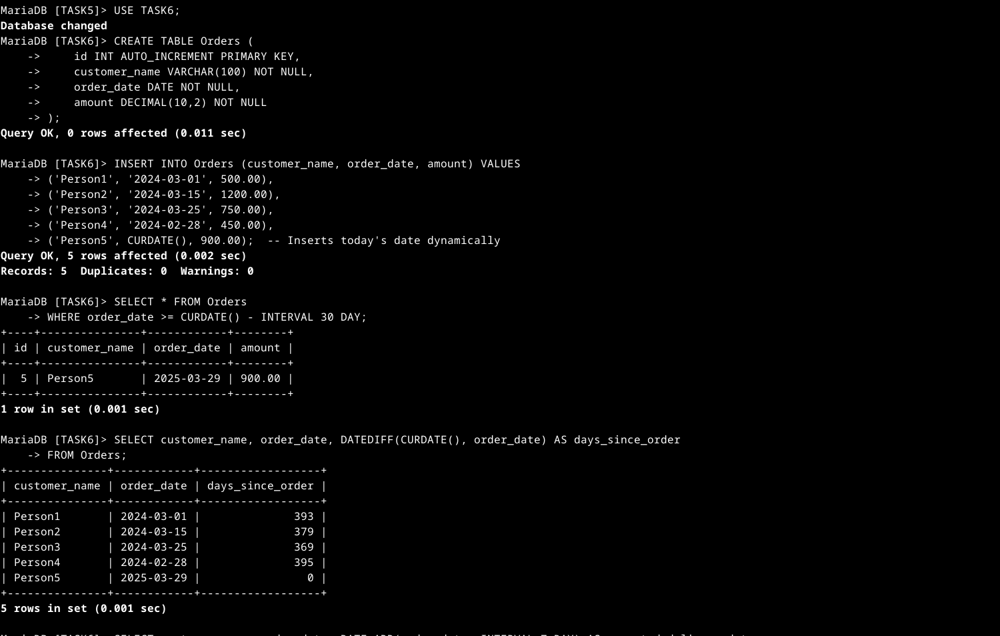

# SQL Keywords Used in Date and Time Functions

| Keyword        | Function |
|---------------|-----------------------------------------------------------|
| `CREATE TABLE` | Defines a new table with specified columns and data types. |
| `PRIMARY KEY`  | Ensures each record in a table has a unique identifier. |
| `AUTO_INCREMENT` | Automatically generates a unique value for a column. |
| `INSERT INTO`  | Adds new records into a table. |
| `VALUES`       | Specifies values to be inserted into a table. |
| `CURDATE()`    | Returns the current date. |
| `INTERVAL`     | Used with `DATE_ADD` and `DATE_SUB` to modify dates. |
| `DATEDIFF()`   | Returns the difference in days between two dates. |
| `DATE_ADD()`   | Adds a specific time interval to a date. |
| `DATE_FORMAT()`| Formats a date into a specific format. |
| `SELECT`       | Retrieves data from a table. |
| `FROM`         | Specifies the table from which to retrieve data. |
| `WHERE`        | Filters records based on a condition. |
| `>=`           | Compares values to filter results. |

