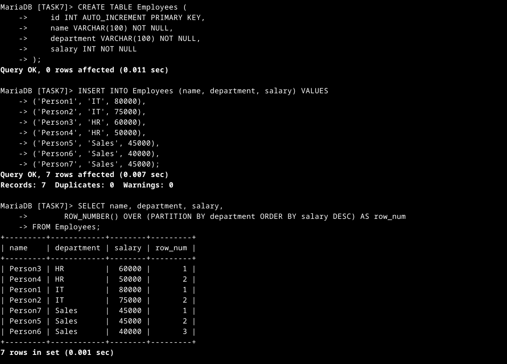
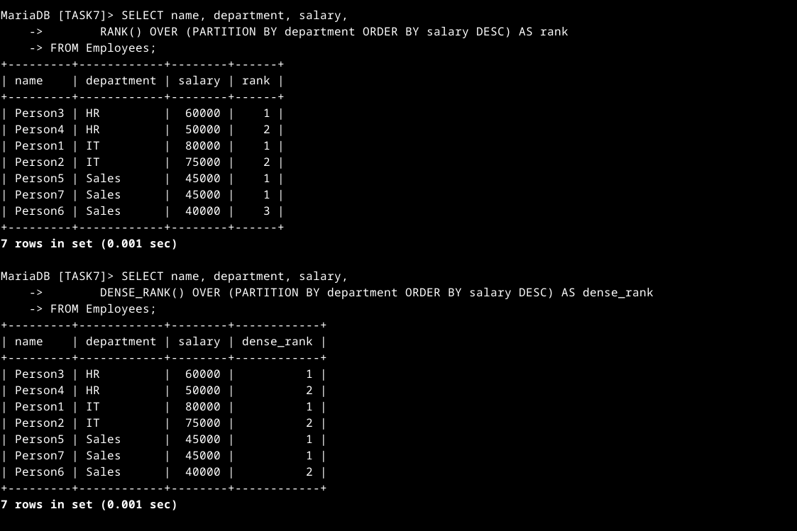

# SQL Keywords Used in  Window Functions and Ranking

| Keyword          | Function |
|-----------------|-----------------------------------------------------------|
| `CREATE TABLE`  | Defines a new table with columns and constraints. |
| `INSERT INTO`   | Adds new records into a table. |
| `PARTITION BY`  | Divides the result set into groups for window functions. |
| `ORDER BY`      | Specifies ranking or sorting order. |
| `ROW_NUMBER()`  | Assigns a unique row number within each partition. |
| `RANK()`        | Assigns a rank, skipping numbers for ties. |
| `DENSE_RANK()`  | Assigns a rank without skipping numbers for ties. |

