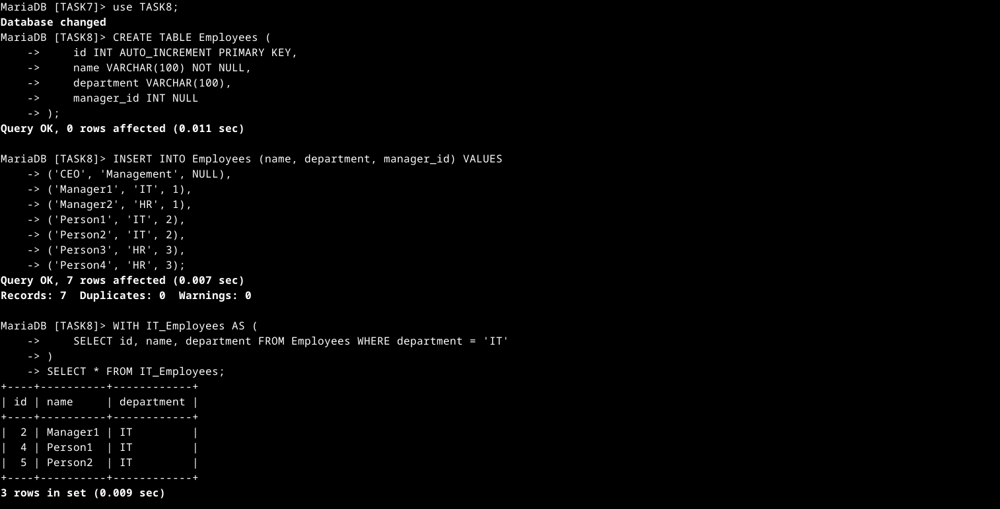
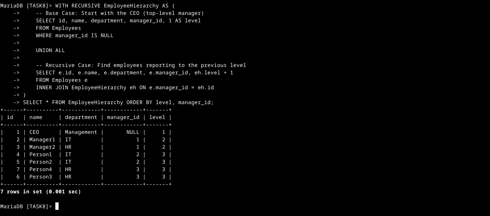

# SQL Keywords Used in CTEs and Recursive Queries

| Keyword       | Function |
|--------------|---------------------------------------------------------|
| `CREATE TABLE` | Defines a new table with columns and constraints. |
| `INSERT INTO` | Adds new records into a table. |
| `WITH`        | Defines a **Common Table Expression (CTE)**. |
| `WITH RECURSIVE` | Defines a **recursive CTE** to process hierarchical data. |
| `UNION ALL`   | Combines results from **base case and recursive case**. |
| `INNER JOIN`  | Joins the recursive CTE with the original table. |
| `ORDER BY`    | Sorts the hierarchical data. |

