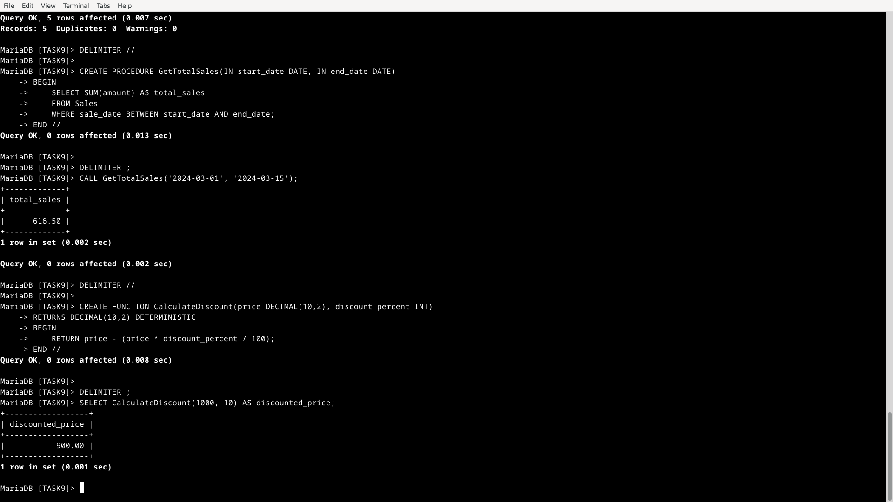

# **SQL Keywords Used in Stored Procedures & UDFs**

| **Keyword**        | **Function** |
|--------------------|---------------------------------------------------------|
| `CREATE TABLE`    | Defines a new table structure. |
| `INSERT INTO`     | Adds new records to a table. |
| `DELIMITER`       | Changes the default statement delimiter (needed for multi-line procedures/functions). |
| `CREATE PROCEDURE` | Defines a stored procedure. |
| `IN`              | Specifies input parameters in stored procedures. |
| `BEGIN ... END`   | Defines the body of a procedure or function. |
| `SELECT`          | Retrieves data from a table. |
| `SUM()`           | Computes the total sum of a numeric column. |
| `BETWEEN`         | Filters data within a range (e.g., date range). |
| `CALL`            | Executes a stored procedure. |
| `CREATE FUNCTION` | Defines a user-defined function (UDF). |
| `RETURNS`         | Specifies the return data type for a function. |
| `RETURN`          | Returns a value from a function. |
| `DETERMINISTIC`   | Indicates that the function will always return the same output for the same input. |

